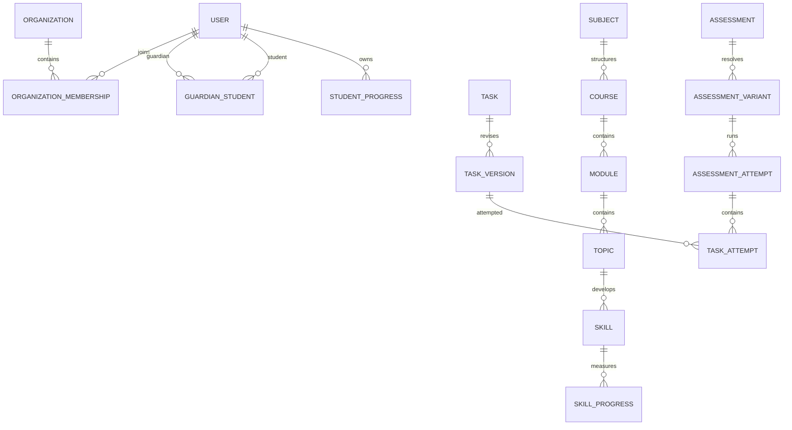

# Conceptual Domain Model

This is a conceptual model, not a final schema. Entity names may be refined during implementation design.

## Identity, Access, and Relationships

- **User:** platform identity and profile owner. Lifecycle: invited/registered, active, suspended, deleted/anonymized.
- **Organization:** optional tenant/workspace. Lifecycle: created, active, archived.
- **OrganizationMembership:** scoped relationship between a user and organization. It carries membership status and permissions, not global user identity.
- **Role/Permission:** policy definitions and scoped grants. Avoid treating a role string as the entire authorization system.
- **ParentStudent / GuardianStudent:** explicit relationship between guardian and student, with status, scope, consent, and lifecycle.
- **Class/Group:** teacher or organization-managed cohort.
- **Enrollment:** student participation in a class, course, or program with an explicit owner and status.

## Educational Content

- **Subject:** generic educational subject.
- **Course:** an organized subject offering or preparation program.
- **Module, Topic, Skill:** hierarchical and graph-compatible learning taxonomy. Skills may have prerequisites.
- **Task:** stable conceptual identity for an educational problem.
- **TaskVersion:** immutable content, answer schema, evaluation rules, metadata, and provenance at a revision.
- **Material:** optional explanation, media, reference, or solution artifact associated with content.
- **ContentSource, ImportBatch, RawImportedContent, NormalizedContent:** ingestion provenance and transformation lifecycle.
- **Examination and ExaminationSpecification:** generic external assessment concepts. OGE/EGE-specific rules are configurations, not foundational entities.

## Learning and Teaching

- **Training:** a practice activity with selection criteria or explicit task versions.
- **LearningSession:** a learner's execution context for training or self-directed practice.
- **Homework:** teacher assignment wrapper around a training or assessment activity.
- **Assessment:** generic diagnostic, practice, slice, simulation, or future examination definition.
- **AssessmentVariant:** resolved task set/rules for an assessment instance.
- **AssessmentAttempt:** learner execution of a variant.
- **TaskAttempt:** execution against one exact TaskVersion, whether in training, homework, or assessment.
- **Result/Score:** derived evaluation output retained with the applicable rules/version.
- **StudentProgress:** aggregate progress for a learner and course/subject context.
- **SkillProgress:** evidence and deterministic mastery state for a skill.
- **LearningPath:** ordered or rule-based set of learning activities, owned by a teacher, system, or later organization.
- **Recommendation:** deterministic proposed next activity with evidence and lifecycle; AI may enrich its explanation.
- **TeacherFeedback:** human feedback attached to an assignment, attempt, or result.

## Platform and Intelligence

- **AIConversation, AIMessage, AIRequest:** conversation and request history with provider/model metadata and policy status.
- **AIContext:** a traceable, minimized snapshot of authorized context used for one AI request; not authoritative learning state.
- **Notification:** user-facing delivery record and preference-controlled state.
- **AuditLog:** append-only record of sensitive actor/resource actions.
- **AnalyticsEvent:** append-oriented fact with actor, scope, resource, timestamp, and schema version.

## Core Relationships

## Lifecycle Invariants

- Historical attempts reference exact published task versions and applicable evaluation rules.
- Publication creates a usable content version; editing creates a new version where history could change.
- Progress is derived from durable evaluation facts and explicit rules.
- Organization membership and guardian relationships are independent authorization dimensions.
- AI artifacts can expire or be deleted without changing authoritative learning state.
