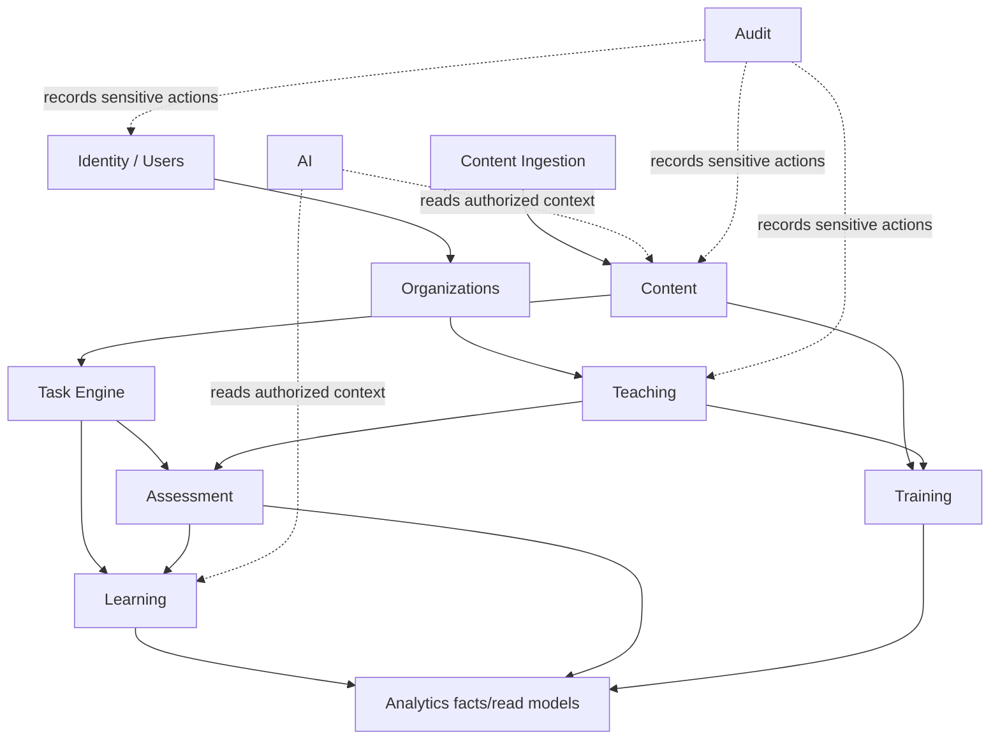

# Domain Boundaries

## Boundary Rules

- A module owns its business state and invariants.
- Other modules read through explicit application interfaces or stable projections, not another module's tables.
- Cross-module writes occur through commands/use cases owned by the target module.
- Analytics consumes facts and does not mutate learning or assessment state.
- AI requests context and returns assistance; it cannot commit authoritative state.

## Identity and Authentication

- **Responsibility:** accounts, credentials, sessions, authentication factors, account lifecycle.
- **Owns:** user identity and session state.
- **Reads:** none beyond identity providers and security policy.
- **Writes:** identity and session state.
- **Depends on:** external identity provider only if adopted.
- **Invariant:** authentication proves identity, not resource permission.

## Users

- **Responsibility:** profiles and user preferences.
- **Owns:** profile data and user-level settings.
- **Reads:** identity and relationship summaries.
- **Writes:** profile fields within policy.
- **Depends on:** Identity.
- **Invariant:** profile ownership is distinct from organization membership.

## Organizations and Memberships

- **Responsibility:** tenant/workspace membership, invitations, organization ownership.
- **Owns:** organizations, memberships, organization roles and scopes.
- **Reads:** user identity and relationship references.
- **Writes:** membership lifecycle and tenant settings.
- **Depends on:** Identity and Users.
- **Invariant:** every organization-scoped operation has an explicit organization context.

## Content

- **Responsibility:** canonical subjects, courses, modules, topics, skills, tasks, task versions, materials, publication.
- **Owns:** canonical educational content and its lifecycle.
- **Reads:** ingestion output and organization ownership context.
- **Writes:** canonical content and publication state.
- **Depends on:** Content Ingestion for imports; Audit for sensitive changes.
- **Invariant:** published task versions are immutable historical references.

## Content Ingestion

- **Responsibility:** external source adapters, raw imports, normalization, validation, provenance, licensing, moderation queues.
- **Owns:** import batches and raw/normalized import artifacts.
- **Reads:** source configuration and content taxonomy.
- **Writes:** ingestion artifacts and publish proposals, never unreviewed canonical publication.
- **Depends on:** Content taxonomy; Jobs/Object Storage.
- **Invariant:** raw source data remains traceable to any derived canonical content.

## Task Engine

- **Responsibility:** answer schemas, validation, deterministic evaluation, attempt-facing task contracts.
- **Owns:** evaluation rules associated with supported task versions and task-attempt results.
- **Reads:** published task versions and assessment context.
- **Writes:** attempt evaluation outcomes through Learning/Assessment workflows.
- **Depends on:** Content; no AI dependency.
- **Invariant:** identical version and answer inputs produce auditable evaluation outcomes.

## Training

- **Responsibility:** teacher-created and learner-facing practice activities.
- **Owns:** training definitions, sessions, selection policies, assignment composition.
- **Reads:** Content, Learning progress, Teaching recipients.
- **Writes:** training and session state.
- **Depends on:** Content and Learning interfaces.
- **Invariant:** activities resolve to specific published versions when work begins.

## Learning

- **Responsibility:** progress, skill/topic evidence, mastery, weakness detection, deterministic recommendations and learning paths.
- **Owns:** student learning state.
- **Reads:** evaluated attempts, content taxonomy, activity history.
- **Writes:** progress, mastery evidence, and recommendation state.
- **Depends on:** Task Engine and Assessment results; does not depend on AI.
- **Invariant:** every state change is explainable from recorded evidence and rules.

## Assessment

- **Responsibility:** generic assessments, slices, specifications, variants, timing, attempts, scoring orchestration, results.
- **Owns:** assessment definitions and assessment attempt state.
- **Reads:** published task versions and evaluation contracts.
- **Writes:** assessment and task-attempt outcomes.
- **Depends on:** Content and Task Engine; emits facts to Learning/Analytics.
- **Invariant:** an attempt retains the exact task version and applicable rules.

## Teaching and Homework

- **Responsibility:** teacher activities, recipients, groups, homework assignment and review workflow.
- **Owns:** teaching relationships, assignment state, teacher feedback records.
- **Reads:** Users, Organizations, Content, Training, Assessment, Learning summaries.
- **Writes:** assignments, recipient state, feedback, and group membership where authorized.
- **Depends on:** organization scope and target activity modules.
- **Invariant:** a teacher may act only through an explicit student, group, or organization relationship.

## Analytics

- **Responsibility:** event capture, projections, teacher/student/organization reporting, product metrics.
- **Owns:** analytics events and derived read models.
- **Reads:** facts from all relevant modules.
- **Writes:** analytics projections only.
- **Depends on:** no domain may depend on analytics for correctness.
- **Invariant:** analytics failure cannot invalidate an attempt or progress transaction.

## Notifications

- **Responsibility:** in-app and future channel delivery.
- **Owns:** notification preferences and delivery state.
- **Reads:** assignment, assessment, and system events.
- **Writes:** notification records and delivery attempts.
- **Depends on:** Jobs and external delivery providers.
- **Invariant:** notification delivery is best effort and never grants access.

## AI

- **Responsibility:** context assembly, prompt policy, model routing, usage controls, response validation, conversations.
- **Owns:** AI conversations, messages, requests, usage records, and safety outcomes.
- **Reads:** explicitly authorized task, learner, teacher, and result context.
- **Writes:** AI artifacts and proposed assistance only.
- **Depends on:** domain read interfaces and external model providers.
- **Invariant:** AI cannot write scoring, permissions, mastery, billing, or assessment state.

## Audit

- **Responsibility:** security and business audit trail.
- **Owns:** audit events and retention policy metadata.
- **Reads:** actor and resource identifiers.
- **Writes:** append-only records.
- **Depends on:** none; all sensitive modules may emit audit facts.

## Later Modules

Billing and Integrations remain separate future modules. Billing may read entitlements and usage but must not own learning access decisions inside unrelated modules. Integrations may expose stable contracts and mappings without bypassing internal authorization.

## Dependency Shape

Analytics and AI are deliberately downstream/read-oriented, preventing circular authority.
