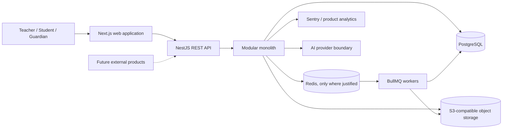
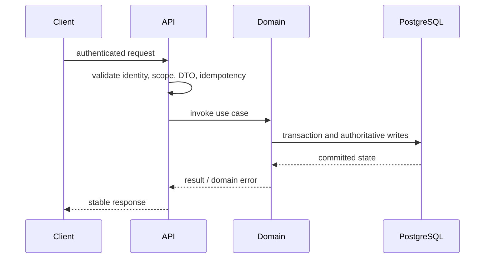
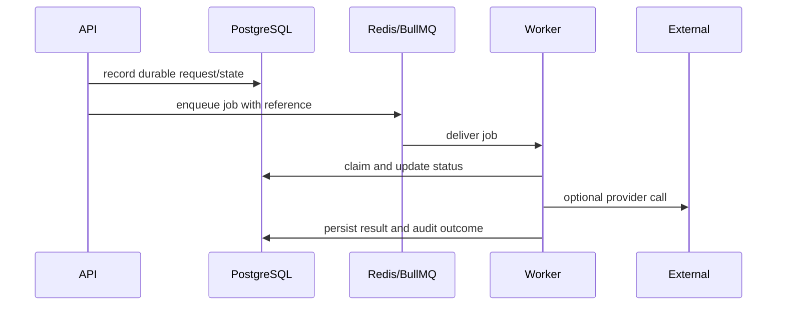

# Architecture Overview

## Status and Principles

- **Confirmed:** modular monolith, PostgreSQL source of truth, generic assessment/content concepts, immutable published task versions, deterministic learning state, and AI as a supporting subsystem.
- **Proposed default:** Next.js frontend, NestJS backend, REST/OpenAPI, Drizzle candidate, managed infrastructure.
- **Deferred:** microservices, Kubernetes, Kafka, event sourcing, universal CQRS, vector databases, and ML infrastructure.

The stack below is a proposed implementation baseline, not a claim that dependencies have already been selected or installed.

## System Shape

The browser is a client, not an authority. Domain modules enforce authorization, evaluation, state transitions, and invariants on the server.

## Frontend

Next.js, React, and TypeScript provide the future reference/demo web application. Tailwind CSS and shadcn/ui may provide implementation primitives, but the canonical Teachly visual identity is defined in `docs/product/teachly-design-system.md`; a generic shadcn dashboard is not the target. React Hook Form and Zod support form validation; TanStack Query manages server state. The frontend should consume typed API contracts and must not duplicate authoritative scoring or permission logic.

## Backend

NestJS hosts bounded modules in one deployable application. Modules expose application services or internal contracts rather than reaching through one another's persistence details. REST is the initial API style and OpenAPI is the contract/documentation format.

Drizzle is the preferred ORM candidate because it keeps SQL and PostgreSQL behavior visible while providing TypeScript typing. Prisma and a lower-level query approach remain alternatives to evaluate during repository setup against migration control, PostgreSQL feature coverage, transaction ergonomics, generated types, and team familiarity. This choice is intentionally not finalized by Phase 0.5.

## Data and Jobs

PostgreSQL stores authoritative users, relationships, content state, attempts, assessments, learning state, audit records, and core events. Redis is optional for rate limiting, short-lived state, cache, and queue coordination. BullMQ is introduced only for work that can be retried or separated from a request: imports, validation, notifications, AI work, and analytics projections.

S3-compatible storage holds files and media. Database records retain metadata, ownership, lifecycle, and integrity references.

## Request Flow

## Asynchronous Flow

Jobs must be idempotent, observable, bounded, and safe to retry. A queue is not the source of truth.

## Security Boundaries

- Browser to API: TLS, authenticated session/token, request validation, rate limits.
- API to modules: server-side authorization and organization/relationship scope.
- Content import: untrusted external payload boundary with validation and provenance.
- Object storage: private buckets, signed access, MIME/size checks, malware controls.
- Code execution, if introduced: isolated disposable sandbox with no application-network trust.
- AI provider: minimized context, policy checks, provider isolation, usage limits, and no authority over business state.

## Observability

Sentry or equivalent captures errors and traces without leaking sensitive content. PostHog or equivalent captures product events after privacy review. Operational logs use correlation IDs and structured fields, exclude secrets, and distinguish tenant-scoped data from platform diagnostics.

## Deployment

Use managed PostgreSQL, managed object storage, and a simple managed application/worker deployment initially. Scale the monolith and workers independently only when measurements justify it.
